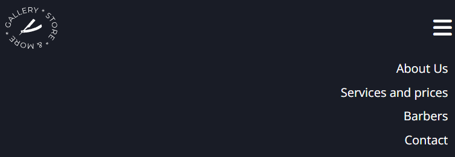
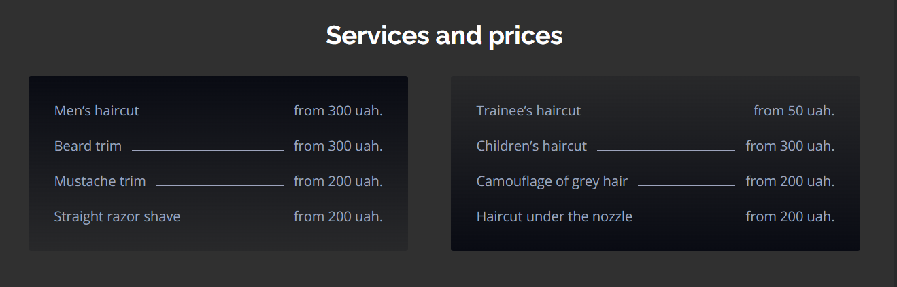
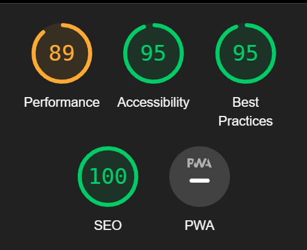

# Barbershop

is a site for men who are looking for the perfect hairstylist.

It showcases employees and their social networks so that site users can view portfolios of work and choose the one they like best. It is also very convenient that customers have access to information about prices and services, and they can immediately leave their data and wishes for a recording.

## Features

- ### Navigation Bar

The responsive navigation bar includes a link to the logo, which is also a link to the main page, as well as links to the About Us page, Services and Prices page, Barbers page and Contact page, and Online Booking. On the mobile version of the site, the site navigation is shown using a burger menu, which saves the header space quite well.

- ### The landing page image

represents a photo with an image of a man's beard cut, as well as text over the image, drawing the attention of potential customers to the exquisite work of masters.

- ### Best Barbershop in your city section

includes images of the work of the masters and introductory text, which allows users to understand the advantages of the Barbershop service and provides quick access to online registration.

- ### Services and prices

this section helps users to immediately familiarize themselves with the type of services and prices, which saves time.

- ### Our barbers section

includes getting to know the master by presenting his photo. And also includes links to his social networks, which will help customers learn more about the master himself and his works.

- ### Contacts section consists of two parts.

The first is an online registration form. It is important that the user can enter his wishes and comments in the Message input field.
The second - contact data - location with a link to the map, quick dialing with one click on the line with the number. And also a link to write an email.
It is very convenient to provide information about the work schedule, which will help users better decide on the appropriate hour for recording.

- ### The Footer

The footer section includes links to the relevant social media sites such as Instagram and Youtube. The links will open to a new tab to allow easy navigation for the user.

## Features Left to Implement

The burger menu will disappear automatically when you click on the corresponding section.

## Technologies and Tools

_The following technologies were used to create this project:_

1. HTML;
2. CSS.

_The following tools helped to develop this project:_

1. Code editor VSC;
2. Googl Chrome Dev Tools;
3. [Google Fonts](https://fonts.google.com/) for importing the font families used.;
4. Github - for version control;
5. [Squoosh](https://squoosh.app/) - to compress photos;
6. Favicon.io - To create and download the favicon logo;
7. [Font awesome](https://fontawesome.com/) - for the social media icons.

## Fixed bugs

The first problem I faced was the large size of the images, which is why they were uploaded with a delay. Using a resource like [Squoosh](https://squoosh.app/) did not fix this situation. Therefore, I first cut the pictures to the maximum calculated size, and only then add them to the project. With these actions, it was possible to increase performance at lightouse

## Testing

- HTML
  No errors were returned when passing through the official [W3C validator](https://validator.w3.org/#validate_by_input)
  

- CSS
  No errors were found when passing through the official [(Jigsaw) validator](https://jigsaw.w3.org/css-validator/#validate_by_input)
  

- Lighthouse
  Lighthouse from the Chrome Developer tools was used to test the performance, accessibility, best practices and SEO of each page on the website.
  

## Deployment

The site was deployed to GitHub pages.

The live link can be found [here](https://katya-semeniuk.github.io/barbershop/)

To deploy on Github pages, the following steps can be taken:

Log in to GitHub and locate the GitHub Repository

1. Go to the settings tab
2. Go to the GitHub Pages section
3. Go to the Source section and select the Master Branch
4. Once the page has refreshed, scroll back down to the GitHub Pages section to locate the now published site link.

To fork the repository:

1. Log in to GitHub and locate the GitHub Repository
2. At the top of the Repository, on the right side of the page, select "Fork"
3. You should now have a copy of the original repository in your GitHub account, and you can deploy it to GitHub pages following the steps above

## Credits

- Favicon was created at [Favicon.ico & App Icon GeneratorFrom Dan's Tools](https://www.favicon-generator.org/)

- The icons in the Our Barbers and Contacs sections were taken from [Font awesome](https://fontawesome.com/)

- The link to the location was taken from [Googl map](https://maps.google.com/)

- Site image on different devices [Mockup screenht generator](https://ui.dev/amiresponsive)

All pictures were taken from [Pexels.com](https://www.pexels.com/uk-ua/search/barbershop/)
